  

  
  
  

---

## 🚀 About Me

  

### 🧠 System Architecture

* 🔍 **`model.compile(optimizer='curiosity')`**
  I dive deep into the architecture of Intelligent Systems, exploring how neural networks and algorithms actually function under the hood rather than just treating them as black boxes.

* 💻 **`model.fit(skills)`**
  Actively training my brain and building AI models from scratch. Proficient in Python, Deep Learning, and NLP, with hands-on experience using TensorFlow and Keras.

* 🚀 **`model.predict(future)`**
  Focused on bridging the gap between core AI and functional applications (sometimes wrapping them up with Flutter!). I love simplifying complex tech and deploying it into real-world projects and ventures.

---

## 🛠️ Languages & Tools

  

---

## 📈 GitHub Metrics

<table align="center" border="0" cellpadding="0" cellspacing="0">
    <td colspan="2" align="center" valign="top">
       
      
    </td>
  </tr>
</table>

---

  

